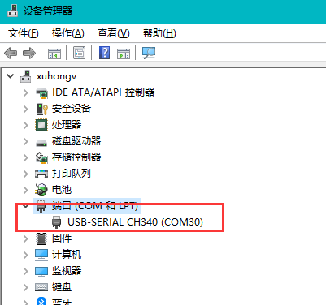
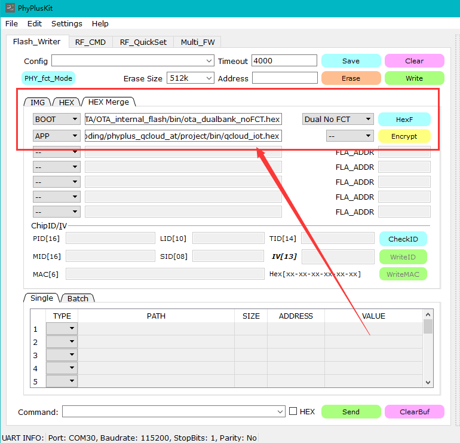
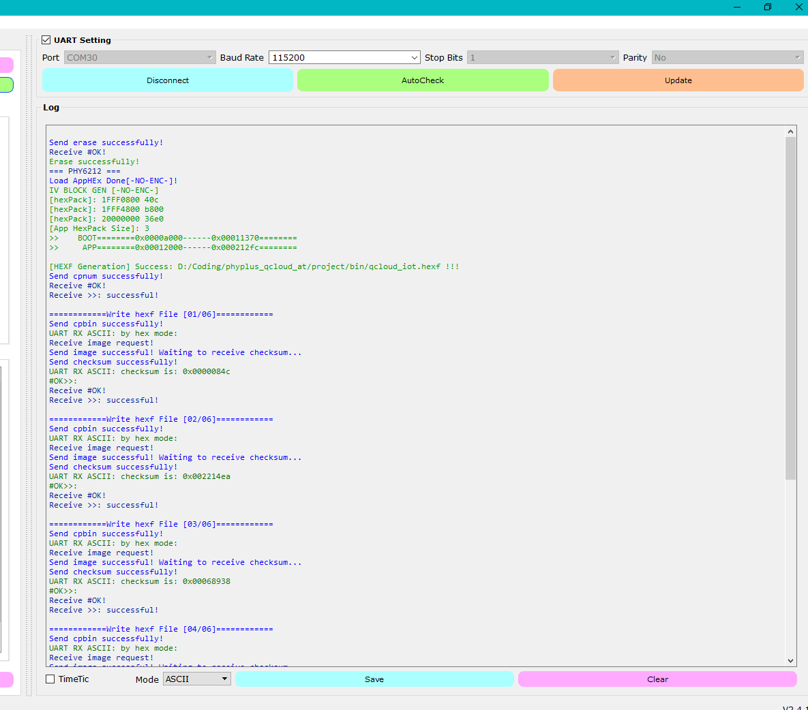
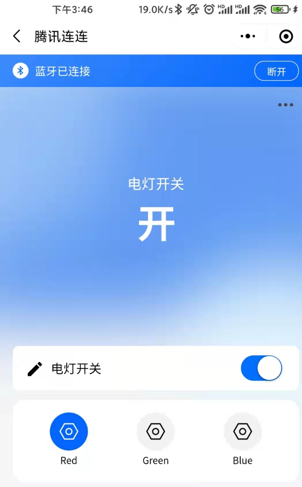

## 项目说明

本工程项目是基于安信可蓝牙模组PB系列基于 LLSnyc 协议通讯于腾讯连连小程序的工程。


| 适合的模组 | PB-01 | PB-02 |
| ----------------- | ----- | ----- |


# 一、注册腾讯物联开发平台设备

## 新建项目

1. 登录 [物联网开发平台控制台](https://console.cloud.tencent.com/iotexplorer)，选择【公共实例】或者您购买的【标准企业实例】进入项目管理页面。
2. 单击【新建项目】，在新建项目页面，填写项目基本信息，单击【保存】。
   
   - 项目名称：输入“智能灯演示”或其他名称。
   - 项目描述：按照实际需求填写项目描述。

## 新建产品

1. 进入该项目的产品列表页面，单击【产品开发】>【新建产品】。
2. 在新建产品页面，填写产品基本信息，单击【保存】。
   

- 产品名称：输入“蓝牙智能灯”或其他产品名称。
- 产品类型：选择【智慧生活】>【电工照明】>【灯】。
- 设备类型：选择“设备”。
- 认证方式：选择“密钥认证”。
- 通信方式：选择“BLE”。
- 其他选项保持默认。

## 创建数据模板

1. 打开刚刚创建的【蓝牙智能灯】产品。
2. 单击【数据模板】>【导入 JSON】进入“导入 JSON“ 页面。
   
3. 打开代码中的 `tools\template_aithinker.json`，如果出现乱码请将您的编辑器修改为 UTF8 编码，将文件中的代码粘贴进来，单击【导入】。
   

## 选择设备开发方式

本文采用标准蓝牙协议（LLSync 协议）方式进行开发，在【设备开发】页面，请选择“基于标准蓝牙协议开发（默认）”的开发方式。如您需要选择“基于自定义蓝牙协议开发”的开发方式，请另参见 [H5 自定义开发指南](https://cloud.tencent.com/document/product/1081/49028)。


## 交互开发配置

配置产品在小程序端的控制面板、快捷入口，若不配置则使用系统默认配置。

## 新建设备

在【设备调试】页面中，单击【新建设备】，输入设备名“ble_device_01”或其他设备名称，单击【保存】。


# 二、设备端操作

### 硬件简介与连接

连接实物图操作步骤如下：

1. 使用 USB 线连接开发板的串口至电脑。
2. 打开设备管理器，若不能识别请重新安装驱动。



### 准备软件环境

前往 [https://www2.keil.com/mdk5/](https://www2.keil.com/mdk5/) ，安装 keil5 软件。

工程源码获取邮箱联系安信可开源团队 xuhongv@aithinker.com ，附上公司名字、项目情况、申请原因等。

### 工程目录

```
PHY62XX_SDK_2_1_2                      # 依赖的底层 SDK 源码文件
project
 ├─Source                              # 源文件
  ├─device                             # 文档
  ├─peripheral_hal                     # 外设Hal层
  ├─qcloud_hal                         # 蓝牙适配层Hal
  ├─at_task.c                          # AT指令相关代码
  ├─main.c                             # 程序入口文件
  ├─qcloud.c                           # ota适配代码
  ├─qcloud_Main.c                      # LLSync协议程序文件
  ├─user_config.h                      # 用户配置头文件
tools                                  # 转换模板的工具
qcloud_at                              # AT指令相关适配层代码
qcloud_iot_explorer_ble
  ├─config                            # SDK 配置文件
  ├─docs                              # 文档
  ├─inc                               # 头文件
  ├─scripts                           # 脚本
  │   ├─interpret_json_dt             # 数据模版转换
  └─src                               # LLSync源码
      ├─core                          # 核心代码
      ├─internal_inc                  # 内部头文件
      └─utils                         # 工具代码
```

先在腾讯物联开发平台注册产品，拿到三元组，并且替代工程源码的默认三元组 \phyplus_qcloud_at\project\Source\qcloud.h

```
#define PRODUCT_ID "Z57EKQBG86"
#define DEVICE_NAME "AiThinker03"
#define PRODUCT_SECRET "oLKC/uxWqwl2Ng0hAR1IQA=="
```

### 烧录步骤

- 1、先通过安信可资料库网站下载一个固件烧录工具：https://docs.ai-thinker.com/_media/ble/hardware/pb-download.zip
- 2、由于安信可PB系列模组是采用ARM核的，编译源码需要Keil 5的编译软件，源码获取：https://github.com/Ai-Thinker-Open/Ai-Thinker-Open-PB-LLSyncSDK ，如需技术支持请联系 xuhongv@aithinker.com ，附上公司名字、项目情况、申请原因等。
- 3、编译源码之后，需要烧录2个固件：第一个是 tools/ota_dualbank_noFCT.hex 文件，第二个是编译生成的 project\bin\qcloud_iot.hex 文件。
- 4、选择PhyPlusKit.exe工具，打开 HEX Herge 选项卡，选择以上2个工具，具体的配置截图如下：



- 5、打开 PhyPlusKit.exe 工具右侧的 UART Setting , 选择PB-01/02开发板的串口 , 并把安信可 PB-01/02 开发板进去烧录下载模式，先按住 PROG ，再按 RST 按键，这时候 PhyPlusKit.exe 工具右侧打印区会出现 cmd>>: 信息，说明已经进去烧录下载模式了。
- 6、先点击 Erase 这个橙色按钮擦除一下模块的内存，再点击 Write 绿色按钮烧录固件进去，如打印下面信息，则说明烧录成功。



# 三、腾讯连连小程序调试

1. 微信主页面下拉并搜索【腾讯连连】小程序。

   
   
2. 点击下方的【+】>【添加设备】。

   
   
3. 按下开发板上的【按键1】开启蓝牙广播，待扫描到蓝牙设备后点击右侧的【连接】。

   
   
4. 在【我的设备】中打开刚刚添加的蓝牙设备。

   
   
5. 点击右侧的【立即连接】连接设备；
   
6. 连接成功后点击【电灯开关】，可以看到开发版上灯珠随之变化。

   
